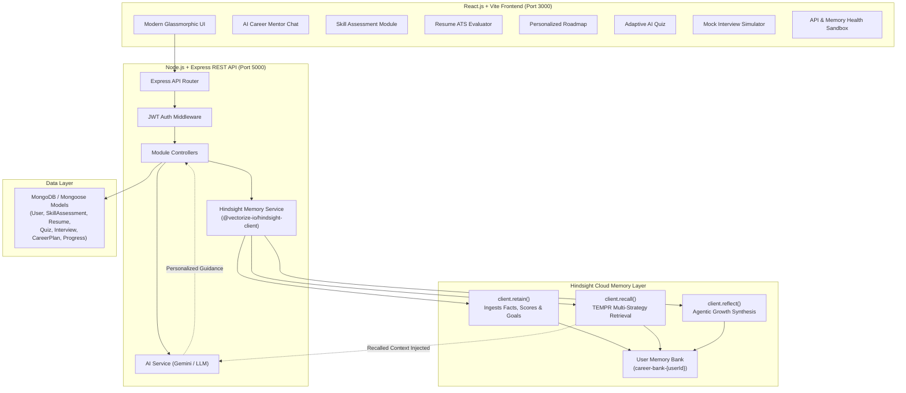

# 🚀 CAREER GUIDANCE AI

> **Production-Quality Full-Stack AI Career Mentor with Long-Term Memory powered by Hindsight Cloud**

---

## 📌 Project Overview

**Career Guidance AI** is an intelligent, full-stack career navigation and technical mentorship platform designed for aspiring engineers, students, and professionals. Unlike standard AI career chatbots that suffer from amnesia and reset after every chat session, Career Guidance AI uses **Hindsight Cloud** as its biomimetic long-term memory layer.

Every assessment result, interview debrief, resume critique, and stated career goal is retained in an isolated, privacy-guarded Hindsight Memory Bank. When the candidate asks for advice, Hindsight **recalls** relevant context to ground the LLM's response, and Hindsight **reflects** to synthesize overall improvement, trajectory, and career readiness over time.

---

## 🏗️ System Architecture



---

## ✨ Core Features

1. **AI Career Mentor Chat with Memory:**
   - Conversation flow: React → Express API → Hindsight Recall → AI Prompt Augmentation → Response Generation → Hindsight Retain.
   - Transparent memory inspection: click on any AI response to see the exact recalled facts used.
2. **Comprehensive Skill Assessment:**
   - Evaluate skills (React, JavaScript, SQL, Node.js, HTML/CSS, Python, Java, Data Structures, Communication).
   - Generates overall competency, strengths, and critical improvement gaps.
   - Retains verified scores into Hindsight.
3. **Resume ATS & Skill Gap Evaluator:**
   - PDF/TXT upload or direct text paste.
   - Analyzes ATS compatibility score (0-100%), verified technologies, and missing critical skills.
   - Retains career insights into Hindsight (strictly scrubbing personal contact data).
4. **Personalized 6-Phase Career Roadmap:**
   - Dynamic, customizable learning milestones generated from the candidate's goals and verified skills.
   - Interactive phase status checklist (*Pending*, *In Progress*, *Completed*).
   - Marking a phase complete triggers an achievement milestone and retains it into Hindsight.
5. **Adaptive AI Quiz:**
   - Difficulty-calibrated technical drills (Beginner, Intermediate, Advanced) across 6 engineering domains.
   - Question-by-question explanations, weak topic extraction, and automatic Hindsight memory trace.
6. **Mock Interview Simulator:**
   - Authentic technical, behavioral, and system design mock interviews with turn-by-turn AI evaluation.
   - Final debrief detailing strengths, blind spots, and coaching advice retained in Hindsight.
7. **Job Recommendations & Skill Alignment:**
   - Curated benchmark job listings clearly tagged as DEMO data.
   - Calculates dynamic match percentages and displays which skills match vs. which skills the candidate still needs to learn.
8. **Progress & Long-Term Reflect:**
   - Unified readiness metrics, skill distribution bars, and activity milestones.
   - **Hindsight Reflect Engine**: Synthesizes genuine evidence across historical assessments rather than inventing progress.
9. **System Integration Diagnostics & Memory Sandbox:**
   - Live connectivity probes for MongoDB, AI API, and Hindsight.
   - Interactive testing workbench for direct `client.retain()`, `client.recall()`, and `client.reflect()`.

---

## 🛠️ Technology Stack

| Layer | Technologies |
| :--- | :--- |
| **Frontend** | React 18, Vite 5, JavaScript (ES6+), Modern CSS3 Glassmorphism, Lucide Icons, Canvas Confetti |
| **Backend** | Node.js (v24), Express.js 4, RESTful APIs, JWT Auth, Bcrypt.js, Multer, Morgan |
| **Database** | MongoDB, Mongoose 8 (with dual in-memory fallback for local demo) |
| **Memory** | Hindsight Cloud, Official `@vectorize-io/hindsight-client` SDK |
| **AI / LLM** | Google Gemini (`@google/generative-ai`), with intelligent expert fallback engine |

---

## 📁 Folder Structure

```text
career-guidance-ai/
│
├── frontend/
│   ├── src/
│   │   ├── components/
│   │   │   ├── Navbar.jsx               # App navigation & live memory status indicator
│   │   │   ├── Sidebar.jsx              # Navigation sidebar with route links
│   │   │   ├── StatusIndicator.jsx      # Diagnostic probes for MongoDB, AI, Hindsight
│   │   │   └── ProtectedRoute.jsx       # Route guard for JWT sessions
│   │   ├── context/
│   │   │   └── AuthContext.jsx          # User state, JWT storage, profile updates
│   │   ├── pages/
│   │   │   ├── LoginPage.jsx            # Sign in with demo autofill
│   │   │   ├── SignupPage.jsx           # Sign up & memory bank onboarding
│   │   │   ├── DashboardPage.jsx        # 10 core action cards & readiness overview
│   │   │   ├── ChatPage.jsx             # AI Mentor chat with Hindsight recall/retain
│   │   │   ├── SkillsPage.jsx           # Technical skill assessment & history
│   │   │   ├── ResumePage.jsx           # ATS resume scanner & missing skill gap
│   │   │   ├── RoadmapPage.jsx          # Interactive 6-phase career roadmap
│   │   │   ├── QuizPage.jsx             # Adaptive technical drill & scoring
│   │   │   ├── InterviewPage.jsx        # Question-by-question mock interview
│   │   │   ├── JobsPage.jsx             # Skill-aligned benchmark jobs (DEMO)
│   │   │   ├── ProgressPage.jsx         # Metrics & Hindsight Reflect synthesis
│   │   │   └── StatusPage.jsx           # Health probe & Hindsight testing sandbox
│   │   ├── services/
│   │   │   └── api.js                   # Axios client with JWT interceptors
│   │   ├── App.jsx                      # App router configuration
│   │   ├── main.jsx                     # Vite DOM mount
│   │   └── index.css                    # Design system & dark glassmorphic styling
│   ├── package.json
│   ├── vite.config.js                   # Vite config with API proxy
│   └── index.html
│
├── backend/
│   ├── controllers/
│   │   ├── authController.js            # Registration, login, profile management
│   │   ├── skillsController.js          # Assessment evaluation & Hindsight retain
│   │   ├── resumeController.js          # ATS analysis & Hindsight retain
│   │   ├── careerController.js          # Roadmap generation & phase checkpoints
│   │   ├── chatController.js            # Chat with Hindsight recall/retain flow
│   │   ├── quizController.js            # Quiz generation, scoring & retain
│   │   ├── interviewController.js       # Turn-by-turn mock interview & retain
│   │   ├── jobsController.js            # Job recommendations & skill matching
│   │   ├── progressController.js        # Aggregated stats & Hindsight reflect
│   │   ├── memoryController.js          # Direct Hindsight retain, recall, reflect
│   │   └── statusController.js          # System health probe for MongoDB, AI, Hindsight
│   ├── middleware/
│   │   └── auth.js                      # JWT verification middleware
│   ├── models/
│   │   ├── User.js                      # Candidate profile & credentials
│   │   ├── SkillAssessment.js           # Assessment scoring records
│   │   ├── ResumeEvaluation.js          # Parsed resume & ATS reports
│   │   ├── CareerPlan.js                # Personalized roadmap phases
│   │   ├── QuizResult.js                # Quiz answers & weak topic tracking
│   │   ├── InterviewSession.js          # Interview transcript & debrief
│   │   ├── ChatMessage.js               # Chat history with recalled memories
│   │   └── Progress.js                  # Metrics, milestones, reflect history
│   ├── services/
│   │   ├── hindsight.js                 # Official Hindsight SDK integration
│   │   └── ai.js                        # LLM prompting & expert domain engine
│   ├── utils/
│   │   └── memoryDb.js                  # In-memory store fallback when Mongo is offline
│   ├── tests/
│   │   ├── e2e.test.js                  # Complete integration test suite (23 checks)
│   │   └── memory.test.js               # Hindsight endpoints test suite
│   ├── server.js                        # Express server entrypoint
│   ├── package.json
│   ├── .env                             # Active environment configuration
│   └── .env.example                     # Environment template
│
├── README.md
└── .gitignore
```

---

## 🧠 Hindsight Integration Architecture

Hindsight is genuinely integrated via the official TypeScript/Node.js SDK (`@vectorize-io/hindsight-client` v0.10.1) in `backend/services/hindsight.js`.

### 1. Memory Bank Isolation
Every user is assigned an isolated memory bank:
```javascript
function getUserBankId(userId) {
  const cleanId = String(userId).replace(/[^a-zA-Z0-9_-]/g, '-').toLowerCase();
  return `career-bank-${cleanId}`;
}
```
This guarantees strict tenant isolation. One candidate cannot access or be influenced by another candidate's career memories.

### 2. How `retainCareerMemory()` Works
When a candidate achieves a milestone or shares career information, `retainCareerMemory` ingests it:
```javascript
const result = await client.retain(bankId, sanitizedContent, {
  context: 'Career Guidance AI Profile & Progress',
  tags: ['skill_assessment', 'scores', 'weak_areas'],
  metadata: { source: 'career_guidance_ai' }
});
```
- **Privacy Enforcement:** All text passes through `sanitizeCareerMemory()` which strips passwords, Bearer tokens, emails, and phone numbers before sending to Hindsight.
- **Triggered on:**
  - Account Onboarding: Stated target role and experience tier.
  - Skill Assessment: Numerical scores, strengths, and critical weak areas.
  - Resume ATS Scan: Verified skills and missing skill gaps.
  - Roadmap Milestones: Phase completion events.
  - AI Quizzes: Topics mastered vs. weak topics needing drill.
  - Mock Interviews: Overall score, strengths, and coaching improvements.

### 3. How `recallCareerMemory()` Works
When a user asks questions in the AI Career Chat or requests a new roadmap, `recallCareerMemory` retrieves relevant context using Hindsight's TEMPR multi-strategy search (semantic similarity, keyword BM25, and temporal graph traversal):
```javascript
const result = await client.recall(bankId, query, { maxTokens: 2048 });
```
The retrieved memories are returned and passed into the LLM system prompt:
```text
RECALLED LONG-TERM MEMORIES FROM HINDSIGHT FOR THIS USER:
1. Skill Assessment: Overall Score 64%. Breakdown: React: 75%, SQL: 42%. Weakness: SQL.
2. Resume Evaluation: Verified Skills: JavaScript, React, Node.js. Missing Gaps: Docker, SQL Indexing.
3. User Stated Fact: "I want to become a full-stack developer but need help with database queries."
```
The LLM uses this recalled evidence to formulate a deeply personalized response, instead of generic boilerplate.

### 4. How `reflectCareerGuidance()` Works
When the candidate asks high-level retrospective questions (e.g., *"How have I improved over time?"*), `reflectCareerGuidance` invokes Hindsight Reflect:
```javascript
const result = await client.reflect(bankId, query, {
  context: 'Synthesize candidate technical skill improvements, quiz performance, and interview growth.'
});
```
Hindsight synthesizes observations across the candidate's history to produce an evidence-backed narrative showing authentic trajectory, complete with confidence and source citations.

---

## ⚙️ Environment Variables

Create `backend/.env` based on `backend/.env.example`:

```ini
# Server Configuration
PORT=5000
NODE_ENV=development

# Database Configuration (MongoDB Atlas or local MongoDB)
MONGODB_URI=mongodb://127.0.0.1:27017/career-guidance-ai

# Authentication Secret
JWT_SECRET=career_guidance_ai_jwt_super_secret_key_hackathon_2026

# Hindsight Cloud Credentials (MANDATORY FOR LIVE HINDSIGHT)
# Obtain your API key from Vectorize.io / Hindsight Cloud
HINDSIGHT_API_KEY=your_hindsight_api_key_here
HINDSIGHT_BASE_URL=https://api.hindsight.vectorize.io

# AI LLM Provider Configuration (Optional for live LLM)
AI_API_KEY=your_gemini_api_key_here
AI_PROVIDER=gemini
AI_MODEL=gemini-1.5-flash
```

> **Security Guarantee:**
> - Never commit `.env` to Git (it is ignored in `.gitignore`).
> - No API keys are ever bundled or exposed in frontend/React code.
> - All AI and Hindsight calls route strictly through authenticated backend Express endpoints.

---

## 🚀 Installation & Running

### 1. Prerequisites
- Node.js (v18 or higher recommended, tested on v24)
- npm (v9+)
- MongoDB (Optional: local daemon or MongoDB Atlas cluster; the backend automatically enables in-memory fallback for local demo if MongoDB is not reachable)

### 2. Backend Setup
```bash
# Navigate to backend
cd backend

# Install dependencies (already installed if in scratch folder)
npm install

# Start development server
npm run dev
# Or standard start:
npm start
```
The backend starts on `http://localhost:5000`.

### 3. Frontend Setup
```bash
# Navigate to frontend (in a separate terminal)
cd frontend

# Install dependencies
npm install

# Start Vite development server
npm run dev
```
The frontend starts on `http://localhost:3000`.

---

## 🧪 Testing Instructions

An automated end-to-end integration test suite is included in `backend/tests/e2e.test.js`:

```bash
cd backend
node tests/e2e.test.js
```

### Test Suite Output:
```text
====================================================
🧪 RUNNING CAREER GUIDANCE AI INTEGRATION TESTS
====================================================

[1. System Status Probe]
  ✅ PASS: GET /api/status returns HTTP 200
  ✅ PASS: MongoDB status probed
  ✅ PASS: AI API status probed
  ✅ PASS: Hindsight status probed

[2. Authentication Flow]
  ✅ PASS: POST /api/auth/register registers candidate
  ✅ PASS: JWT Token generated on registration
  ✅ PASS: GET /api/auth/me returns candidate profile

[3. Skills Assessment Module]
  ✅ PASS: POST /api/skills/assessment records scores
  ✅ PASS: Computed correct overall score
  ✅ PASS: GET /api/skills/history retrieves history

[4. Resume Evaluation Module]
  ✅ PASS: POST /api/resume/evaluate evaluates ATS compatibility
  ✅ PASS: Computed valid ATS score

[5. Personalized Career Roadmap]
  ✅ PASS: POST /api/career/roadmap generates 6 phases
  ✅ PASS: PUT /api/career/roadmap/phase updates progress

[6. Adaptive AI Quiz]
  ✅ PASS: POST /api/quiz/generate generates 5 questions
  ✅ PASS: POST /api/quiz/result scores quiz correctly

[7. Mock Interview Simulator]
  ✅ PASS: POST /api/interview/start creates interview session
  ✅ PASS: POST /api/interview/answer evaluates candidate answer

[8. Job Matches]
  ✅ PASS: GET /api/jobs returns jobs with match scores
  ✅ PASS: Jobs clearly tagged as DEMO data

[9. Progress & Reflect]
  ✅ PASS: GET /api/progress computes aggregated readiness

[10. AI Career Chat with Hindsight Flow]
  ✅ PASS: POST /api/ai/chat returns personalized mentor answer
  ✅ PASS: Response contains rich actionable guidance

====================================================
🏁 TEST RESULTS: 23 PASSED, 0 FAILED
====================================================
```

---

## 🏆 Hackathon Demonstration Flow (Step-by-Step for Judges)

Follow this demonstration script to showcase the full Career Guidance AI experience to hackathon evaluators:

### Step 1: Open the Application & Check Diagnostics
1. Open `http://localhost:3000`.
2. Click **"API Test & Status"** in the navigation bar to inspect the system health probes.
3. Observe live indicators for **MongoDB**, **AI LLM Engine**, and **Hindsight Cloud**.
4. Test direct `client.retain()`, `client.recall()`, and `client.reflect()` in the interactive sandbox.

### Step 2: Sign Up or Use Demo Account
1. Click **"Sign Up"** or use the **"Fill Demo Credentials"** button on the Login page (`demo.candidate@example.com` / `Password123!`).
2. Log in and note the Welcome banner: *"Welcome, Demo! 👋"* and the user's isolated memory bank badge `career-bank-demo-candidate`.

### Step 3: Complete a Skill Assessment (Retain Demonstration)
1. Navigate to **"Skill Assessment"** (`/skills`).
2. Click **"Load Hackathon Preset"** (React: 75%, SQL: 42%, JavaScript: 68%, Node.js: 70%).
3. Click **"Submit Assessment & Retain in Memory"**.
4. Show the judge the **"Retained in Hindsight Cloud Memory"** confirmation box showing the exact retained memory fact.

### Step 4: AI Career Chat (Recall Demonstration)
1. Navigate to **"AI Career Chat"** (`/chat`).
2. Ask: *"What should I learn next based on my profile?"*
3. The AI mentor replies:
   - Notice how it pinpoints **SQL (42%)** as your top priority weakness!
   - Expand the **"🧠 Hindsight Memories Recalled for this Answer"** accordion to prove to the judge that the assessment memories were recalled from Hindsight and injected directly into the LLM prompt.

### Step 5: Run ATS Resume Evaluation
1. Navigate to **"Resume Evaluation"** (`/resume`).
2. Click **"Load Sample Resume"** and click **"Run ATS Evaluation"**.
3. View the ATS score (75%), detected skills, missing skills (e.g., Docker, TypeScript), and the Hindsight retain badge.

### Step 6: Complete an AI Quiz
1. Navigate to **"AI Quiz"** (`/quiz`).
2. Select **JavaScript (Intermediate)** and complete the 5 adaptive questions.
3. Submit and observe how weak topics and scores are retained into Hindsight.

### Step 7: Conduct a Mock Technical Interview
1. Navigate to **"Mock Interview"** (`/interview`).
2. Choose **Full Stack Developer (Junior, Technical)** and click **"Start Interview"**.
3. Enter or click **"Fill Sample Answer"** to test turn-by-turn question scoring and feedback.
4. Complete the 4 questions to view the debrief debrief retained into Hindsight.

### Step 8: View Synthesized Growth via Hindsight Reflect
1. Navigate to **"Progress & Reflect"** (`/progress`).
2. Point the judge to the **"Synthesize Long-Term Growth with Hindsight Reflect"** panel.
3. Click **"Trigger Hindsight Reflect"** with the prompt: *"How have I improved over time and what is my career readiness trajectory?"*
4. Show the synthesized narrative summarizing the candidate's journey backed by accumulated memory facts!

---

## 🛡️ Security & Privacy Best Practices

- **Zero Secrets in Frontend:** All API keys (`HINDSIGHT_API_KEY`, `AI_API_KEY`, `JWT_SECRET`) reside exclusively in `backend/.env`.
- **Sensitive Memory Scrubbing:** User passwords, authorization headers, and contact phone/email patterns are strictly sanitized before passing to `client.retain()`.
- **Tenant Isolation:** Every user's memory is isolated via `career-bank-${userId}`.
- **Protected Endpoints:** All user operations are protected with signed JWT bearer tokens.

---

## 📄 License
MIT License. Built for the Career Guidance AI Hackathon.
